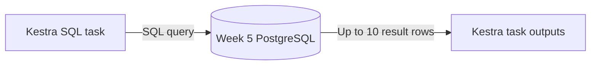

# Week 5 — Part 3: Transform taxi columns with SQL

[Week overview](README.md) · [Previous: a small Python task](part-2-python.md)

## Goal

Write a SQL query that calculates trip duration and classifies trips, then execute it through Kestra. Inspect the returned rows, not just the execution status. Allow about 20–25 minutes.

The query returns a transformed result; it does not change the input table or create a report table. This exercise uses a small sample of real monthly taxi records. Full monthly ingestion comes in Part 4.

## 1. Prepare the sample once

Start this week's environment with `docker compose up -d`. Open [Week 5 pgAdmin](http://localhost:8086), connect to the taxi database as described in the [overview](README.md), and open the Query Tool.

Open [prepare-trip-sample.sql](sql/prepare-trip-sample.sql), paste the entire file into the Query Tool, and execute it. The final count should be **100**.

The file contains the first 100 records from the January 2024 yellow taxi file, reduced to the columns needed here. This is a convenience sample, not a representative sample of NYC trips. No additional download is required. Every record has `source_month = '2024-01-01'`, identifying its source file.

The setup creates `public.taxi_trip_sample`. Rerunning it replaces only this sample's rows, in one transaction. It does not change the full-month table or Kestra's internal database. The setup is provided so today's coding focuses on transformation and orchestration.

## 2. Your task — transform the columns in pgAdmin

Open [trip-transformation-starter.sql](sql/trip-transformation-starter.sql). Replace its two placeholder expressions. Keep the source columns so you can check your calculations.

Your result must contain:

| Column | Required result |
|---|---|
| `pickup_time` | Original pickup timestamp |
| `dropoff_time` | Original drop-off timestamp |
| `trip_distance_miles` | Original trip distance |
| `duration_minutes` | Drop-off minus pickup, expressed in minutes |
| `trip_category` | `short` below your chosen duration threshold, otherwise `long` |

Choose and write down your threshold in minutes. A duration exactly equal to the threshold belongs to `long`. Keep `LIMIT 10` to make the output easy to inspect.

<details>
<summary>Hint: calculating minutes</summary>

Subtracting two PostgreSQL timestamps produces an interval. `EXTRACT(EPOCH FROM interval_expression)` gives its duration in seconds. Convert those seconds to minutes.

</details>

<details>
<summary>Hint: classifying a record</summary>

Use `CASE WHEN condition THEN 'short' ELSE 'long' END`. A column alias defined in a `SELECT` list is not available to another expression in that same list: repeat the duration expression, or use a subquery if you already know how.

</details>

**Check:** choose one returned trip and calculate its duration yourself. Does its category follow your threshold rule?

**Discuss:** what if drop-off is earlier than pickup, or a timestamp is missing? Extend your `CASE` to label these as `invalid` and `unknown` instead of accidentally calling them short or long. Check these conditions before your short/long rule.

## 3. Put your query into a Kestra flow

Open [03-sql-transformation-starter.yaml](flows/03-sql-transformation-starter.yaml). Create a new flow named `taxi_sql_transformation` and complete the same two expressions inside `sql: |`. Preserve the `WHERE` clause that uses the flow's year and month inputs.

```text
Log the selected month → Execute SQL → Log completion
```

| Setting | Meaning |
|---|---|
| `type: ...postgresql.Query` | Ask PostgreSQL to execute one SQL statement. |
| `url` | Connect to host `postgres`, port `5432`, and the taxi database. |
| `username`, `password` | Use the taxi account supplied by this week's Compose configuration. |
| `sql: \|` | The indented lines are the SQL statement. |
| `fetchType: FETCH` | Return the result rows as task outputs. |
| `make_date(year, month, 1)` | Build a date identifying the selected source month. |

The provided connection settings are already configured; your task is to write the transformation. There is no `containerImage` or Docker `taskRunner` here. Kestra's JDBC task sends SQL over the existing network, and **PostgreSQL executes the transformation**.



## 4. Execute and inspect the data

Save and execute with year **2024**, month **1**. Open the execution's **Outputs** view, select `transform_trips`, and inspect `rows`. Compare with your pgAdmin result.

The placeholder query is valid SQL, so it can succeed before you finish the exercise. **SUCCESS alone is not the checkpoint:** verify that durations are calculated and the category no longer says `not classified`.

Change your threshold, save the flow, and run again. Does the result follow the new rule? The sample itself stays unchanged. This particular sample might not contain trips on both sides of every threshold.

Now execute for month **2**. The prepared sample contains January only, so expect zero rows. A valid `SELECT` returning no rows can still succeed.

**Discuss:** What check would you add if an empty result should make this workflow fail?

**Finish with:** your SQL query, a successful January execution with up to 10 transformed records, and an explanation of why PostgreSQL performs this work without a new Python container.

Next: [Part 4 — Run the taxi loader](part-4-run-ingestion.md).

## If something fails

- **Table does not exist:** run the complete setup SQL in the Week 5 taxi database.
- **Authentication or connection error:** check this week's `.env` and that the `postgres` service is running. Do not connect this flow to `kestra-db`.
- **Query succeeds but values are placeholders:** finish both SQL expressions and save the changed flow.
- **No rows:** use year 2024 and month 1 for this prepared sample.
